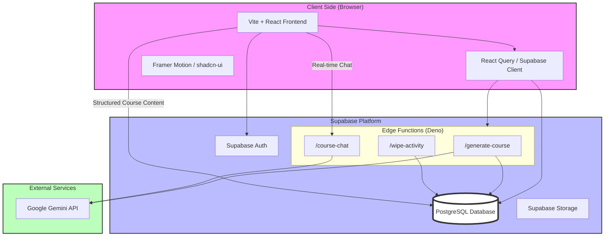
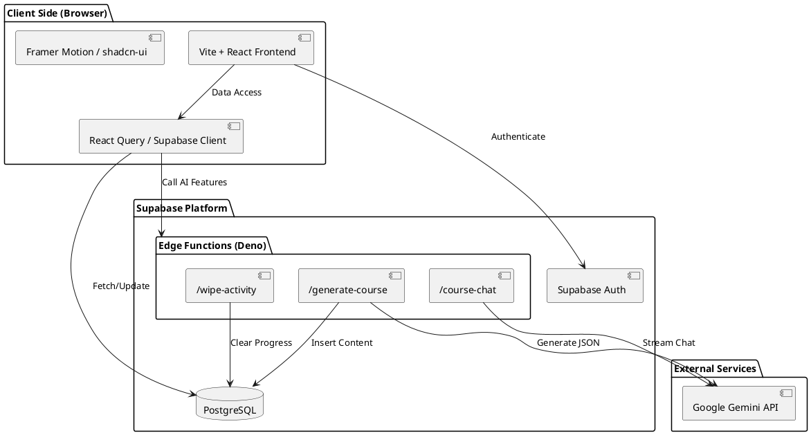

# EduBits Architecture Diagram

This diagram illustrates the high-level architecture of the EduBits platform, showing the interactions between the frontend, Supabase services, and the Google Gemini AI.

## Mermaid Diagram

## PlantUML Diagram

## Component Breakdown

### 1. Frontend (Vite + React)
- **Framework**: React 18 with TypeScript.
- **Styling**: Tailwind CSS and shadcn-ui components.
- **Animations**: Framer Motion for smooth transitions.
- **Data Fetching**: TanStack Query for caching and synchronization with Supabase.

### 2. Backend (Supabase)
- **Auth**: Handles user registration, login, and session management.
- **Database (PostgreSQL)**: Stores courses, modules, lessons, quizzes, and user progress. Uses Row Level Security (RLS) to ensure data privacy.
- **Edge Functions**: Serverless Deno functions that handle complex logic and external API calls.
  - `generate-course`: Orchestrates the AI course creation flow.
  - `course-chat`: Provides a streaming interface for the in-lesson AI tutor.

### 3. AI Integration
- **Provider**: Google Gemini API (`gemini-3.0-pro`).
- **Use Cases**:
  - Structured data generation for multi-module courses.
  - Context-aware tutoring with content restrictions (only answers course-related questions).
